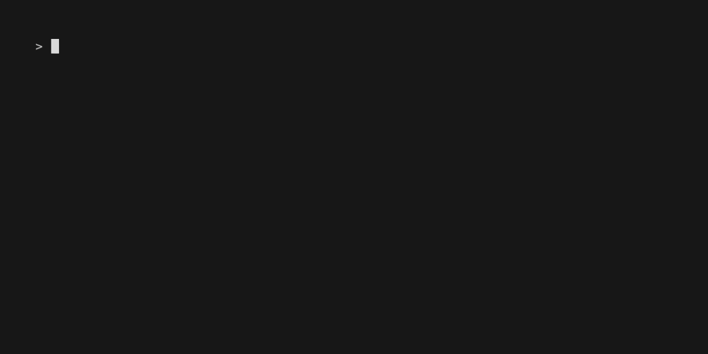
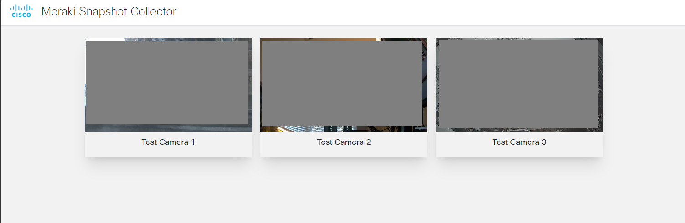

# Cisco Meraki Snapshot Collector

This code repository performs a bulk collection of camera snapshots from Meraki MV cameras.

Using this code, we can:

- Optionally specify a date & time to pull the snapshot from
- Collect a snapshot from all cameras across an organization
- Save all snapshots locally
- Optionally generate an HTML report for easy review

## Contacts

- Matt Schmitz (<mattsc@cisco.com>)

## Solution Components

- Cisco Meraki MV cameras

## Installation/Configuration

### **Step 1 - Clone repo:**

```bash
git clone https://github.com/gve-sw/gve_devnet_meraki_snapshot_collector.git
```

### **Step 2 - Install required dependencies:**

```bash
pip install -r requirements.txt
```

## Usage

### Running locally

The script has built-in help to provide information on the available options:

```text
$ python3 app.py --help

 Usage: app.py [OPTIONS]

 Run bulk collection of snapshots from Meraki MV cameras
 If date & time are not specified, then script will collect snapshots for the current date  
 & time

╭─ Options ────────────────────────────────────────────────────────────────────────────────╮
│ *  --apikey  -k      TEXT                              Meraki dashboard API key          │
│                                                        [env var:                         │
│                                                        MERAKI_DASHBOARD_API_KEY]         │
│                                                        [default: None]                   │
│                                                        [required]                        │
│    --time    -t      [%Y-%m-%d|%Y-%m-%dT%H:%M:%S|      Date & time to collect snapshots  │
│                      %Y-%m-%d %H:%M:%S]                for                               │
│                                                        [default: None]                   │
│    --help                                              Show this message and exit.       │
╰──────────────────────────────────────────────────────────────────────────────────────────╯
╭─ Additional Options ─────────────────────────────────────────────────────────────────────╮
│ --outputdir   -o      TEXT  Output directory [default: snapshots]                        │
│ --outputhtml  -h            Output HTML report                                           │
╰──────────────────────────────────────────────────────────────────────────────────────────╯
```

The only required item is the `apikey` parameter. If this is not provided, the script will prompt to ask for the Meraki dashboard API key. Alternatively, we can specify the key using the `MERAKI_DASHBOARD_API_KEY` environment variable.

If no `--time` parameter is specified, the script will query the cameras for a current snapshot. Otherwise, we can specify time using any of the listed formats in the help message. If using the format with a space between date & time, the input must be wrapped in quotes. For example: `python3 app.py --time "2024-01-31 14:30:00"`

By default, the script will place all snapshots in a local `./snapshots/` directory. This can be overriden using the `--outputdir` argument.

In addition, the script can optionally export an HTML report for easier review. To enable this, use the `--outputhtml` flag. Once generated, the script will create a local `index.html` page to serve the camera snapshots.

# Related Sandbox

This code can be tested with the [Meraki Enterprise Sandbox](https://devnetsandbox.cisco.com/DevNet/catalog/meraki-ent-sandbox).

Alternatively, the [Meraki Always-On](https://devnetsandbox.cisco.com/DevNet/catalog/meraki-always-on) may be used - but may only have mock cameras available, which cannot generate snapshots.

# Screenshots

### Sample script run



### Sample HTML report



### LICENSE

Provided under Cisco Sample Code License, for details see [LICENSE](LICENSE.md)

### CODE_OF_CONDUCT

Our code of conduct is available [here](CODE_OF_CONDUCT.md)

### CONTRIBUTING

See our contributing guidelines [here](CONTRIBUTING.md)

#### DISCLAIMER

<b>Please note:</b> This script is meant for demo purposes only. All tools/ scripts in this repo are released for use "AS IS" without any warranties of any kind, including, but not limited to their installation, use, or performance. Any use of these scripts and tools is at your own risk. There is no guarantee that they have been through thorough testing in a comparable environment and we are not responsible for any damage or data loss incurred with their use.
You are responsible for reviewing and testing any scripts you run thoroughly before use in any non-testing environment.
